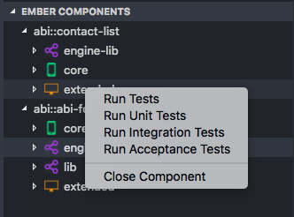

# ember-component-view README

This creates a simple tree view of the open components and all discovered related files for that component.

## Features

This creates a simple tree view of Ember components.  The tree view consists of a top level containing the name of the component, the absolute path, and an icon indicating if the component is core, extended, or shared. The next level down is a list of all files associated with that component, this includes the js and hbs files, as well as all associated tests and the scss stylesheets if they are found.

A component can be opened from the right click menu within the tree view, and closed again from the right click menu on a given component.

Clicking on a given file will open it.

Tests can also be run from the right click menu.  Note that this will set the filter within the pemberly test page, and isn't dependent on if a specific file is found within the codebase.

#### Navigation Menu Right Click

> The right click menu gives you the option to open a given component

#### Component View

> The top level treeview has different icons for each of the specific types of components.  It also includes the full path for a given component in case the same name exists in multiple locations.

> A list of all of the found associated files.  Note that multiple stylesheets may be listed if multiple associated ones are found in the engine and a global/common location.

#### Component Right Click Menu

> Closing or testing a component

## Requirements

None

## Known Issues

None

## Building

In order to build this project you'll need to run 'vsce package'.  More info about that here:
https://code.visualstudio.com/docs/extensions/publish-extension

## Outstanding TODOs

* Add support for services
* Add support for routes
* Add right click menu to open editors window
* Only show right click menu if recognized component
* Add ability to lookup from a stylesheet
* Add ability to lookup from a test file
* Handle special case of shared directory for scss files
* Clean up icons to look like the ones from VS
* Clean up top level icons - add color to light version
* Add save/reload capability on reopen working state
* Add logo for the extension
* Add tests
* Add support for partials
* Add ability to mark if a file is found in the wrong location
* Add ability to open a component from right clicking on a test

## Release Notes

Still in dogfooding stage.

### 0.2.0

* Updated numbering to contain a build number
* Removed 'refresh' capability
* Added more error logging

### 0.1.8

* Refactored code to use built in file search to find components instead of looking in hard coded paths
* Added an output channel for logging so users can get some insight into the code

### 0.1.7

* Nested all platforms for a given component within the component top level

### 0.1.6

* Added more supported filepaths
* Documentation updates

### 0.1.5

* Added more stylesheet lookup locations to handle shared-ext non-standard directories
* Added more test lookup locations to handle shared-ext non-standard directories

### 0.1.4

* Add ability to right click and run all tests or a specific test type for a component
* Refactored file searching to be more readable and easier to add new filepaths
* Add support for global stylesheets

### 0.1.3

* Add support for platform/engines path
* Add support for extended test location
* Added support for more composure phase 2 file locations
* Fix the component name from engine@component to engine::component

### 0.1.2

* Added a right click menu in the tree view to open a component
* Added a right click menu in the extension to close a specific component
* Renamed the component to include the component engine and a full path form
* Fixed to handle the special case of the shared/shared-ext engine which contains an extra directory within the path structure
* Added stylesheet file(s) to the component tree

### 0.1.1

* Added component sorting
* Removed inclusion of scss files
* Added colors for dark theme components
* Tests show the type within the filename

### 0.1.0

* Initial release of Ember-Component-View.
